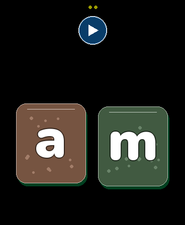
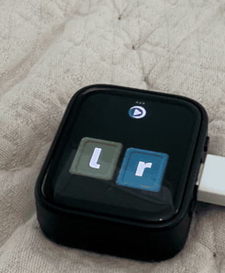
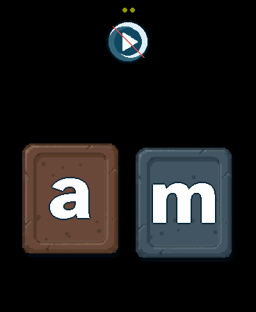

# DEEP SEA PHONICS TOY V2

**Current accepted product release: [DEEP SEA PHONICS TOY V2](CURRENT_RELEASE.md).**
This product name is distinct from the supported Waveshare board's own V2
hardware revision.

An offline, toddler-friendly listening game for the **Waveshare
ESP32-S3-Touch-AMOLED-1.8 V2**. The child hears a lowercase phonics sound and
taps one of two large letter cards. Everything runs on the board: display,
touch, motion, speech, phonics audio, and speaker playback.

The current standby and awake-idle power redesign is documented in
[`docs/POWER_AUDIT.md`](docs/POWER_AUDIT.md). It is compiled, flashed, serial-
verified, and camera-verified on the supported V2 board. Whole-board current
has not yet been measured, and battery/charge-only PWR wake remains a separate
physical gate, so the repository claims structural savings rather than mA or a
percentage.



*Source-faithful 368 x 448 render of the checked-in card, font, and replay
assets. The listening round stays deliberately spare: one replay control and
two large choices.*

> [!IMPORTANT]
> This firmware is for the **ESP32-S3 V2 board with a CO5300 display and CST820
> touch controller**. It is not for an ESP32-C6, and it is not compatible with
> the older V1 board (SH8601 + FT3168). Check the `V2` label on the back before
> flashing. Waveshare documents the revision difference in its
> [official board documentation](https://docs.waveshare.com/ESP32-S3-Touch-AMOLED-1.8).

## Recommended: give this repository to an agent

The easiest installation path is to point a coding agent at this GitHub
repository and ask it to deploy the project to the connected board. The root
[AGENTS.md](AGENTS.md) tells the agent the exact supported hardware, canonical
commands, five required flash regions, safety checks, and verification steps.
Everything needed for a normal build and installation is in the repository, so
the agent can inspect the contract and carry out the deployment without having
to reconstruct the board configuration.

The human still needs to confirm that the rear label says **V2** and identify
the intended serial port before the agent flashes it. A useful prompt is:

> Read AGENTS.md and deploy this project to my connected Waveshare V2 board.
> Show me the detected port and ask me to confirm it before flashing.

### Use this repository for another V2 project

This repository also preserves the reusable board and workflow knowledge for
building a different application on the same exact V2 hardware. Start with the
portable open Agent Skill at
[`develop-waveshare-s3-amoled-v2`](.agents/skills/develop-waveshare-s3-amoled-v2/SKILL.md)
and the public
[exact-board development guide](docs/WAVESHARE_S3_AMOLED_V2_DEVELOPMENT.md).
They explain what can be reused, how to build a fast development/release split,
and which partition, resource, product, and verification decisions must be new
for the other application.

Do not use this game's flash script for another product: the DEEP SEA PHONICS TOY V2
audio pack at `0x610000` and its five-region bundle are application contracts,
not board defaults. A useful agent prompt is:

> Read `.agents/skills/develop-waveshare-s3-amoled-v2/SKILL.md` and the linked
> exact-board guide. Build a separate application for my rear-labeled V2 board,
> reusing only board-level integration and workflow patterns. Define a new
> partition/resource contract, flash manifest, diagnostics, and verification
> plan; do not inherit or install the DEEP SEA PHONICS TOY V2 audio pack.

## Materials

Required:

- **Board:** [Buy the Waveshare ESP32-S3-Touch-AMOLED-1.8 from Waveshare](https://www.waveshare.com/product/esp32-s3-touch-amoled-1.8.htm), and confirm it is **V2**
- a USB-C cable that carries data, not a charge-only cable
- a macOS, Linux, or Windows computer with Git, Python 3.10+, a C++17 compiler,
  and internet access for the first toolchain download

You do **not** need an external speaker, screen, SD card, account, API key, or
Wi-Fi connection. A battery is optional; USB powers the experience. If you add
a battery, use a correctly polarized 3.7 V cell made for the board's MX1.25
2-pin connector. See [Hardware and safety](docs/HARDWARE.md) before connecting
one.

## Install the exact experience

Flashing replaces the factory application. Clone with the pinned Waveshare
submodule, connect the board over USB-C, and run:

```sh
git clone --recurse-submodules https://github.com/KartikC/esp32-phonics-picker.git
cd esp32-phonics-picker
./scripts/setup_toolchain.sh
./scripts/test.sh
./scripts/list_ports.sh
./scripts/flash_firmware.sh --port /dev/cu.usbmodemXXXX
```

On Linux the port is commonly `/dev/ttyACM0`; in Git Bash on Windows it is
commonly `COM3`. The flash script asks for confirmation, verifies that the chip
is an ESP32-S3 with 16 MB flash, builds with the pinned toolchain, and writes
both the application and the checked-in audio pack. Add `--yes` only for a
non-interactive agent run after confirming the target board and port.

If the repository was downloaded without submodules, the setup script fetches
the pinned revision automatically. Full clean-clone and troubleshooting steps
are in [Deployment](docs/DEPLOYMENT.md). Instructions intended for coding
agents are in [AGENTS.md](AGENTS.md).

## How the UI works

1. The board speaks a prompt and one target phonics sound.
2. The child taps one of the two lowercase letter cards.
3. A wrong choice gets a calm spoken response and keeps the same round.
4. A correct choice confirms the card, raises a short animated water scene, and
   shows one large varied sea creature as the reward before the next round. A
   small centered name at the bottom identifies the creature during its
   appearance.



*Fresh, unmirrored camera capture of the checked-in build running on the
physical V2 board. A correct choice raises the water, reveals the named reward,
and returns to a new round in 2.96 seconds.*

The round never prints or otherwise reveals the answer. The fixed ocean-current
**Deep loop** play button at the top repeats the exact current prompt. Gently
tilting the board lets both cards drift together; their hit areas move with
them without changing size or which answer is correct.

For bench work with a USB data cable attached, double-tap inside the complete
42-pixel-radius Deep loop replay target to mute or unmute; a warm-red slash
across the control shows mute. A charge-only cable cannot enable this gesture,
and a sustained data disconnect clears mute.



*The maintenance-mute overlay is painted over the same replay asset, so it adds
no second full-screen image to the firmware.*

The tiny dots at the top are parent-facing battery status:

- three green dots: 60-100%
- two yellow dots: 25-59%
- one red dot: 0-24%

A short press and release of **PWR** toggles quiet standby and resumes the same
round. Hold PWR for about six seconds for the board's hardware power-off; click
PWR once to start again. The **BOOT** button is not part of the game.

During ordinary silent play, the codec, speaker amplifier, and I2S transmitter
power down after a guarded 750 ms idle tail and wake before the next cue. Idle
touch reads are interrupt-gated with a bounded safety poll. These behaviors do
not dim the display, lower audio volume, slow the card motion, or alter any
visible pixels.

There are no scores, streaks, ads, accounts, network calls, microphone use, or
runtime speech generation. See [PRODUCT_SPEC.md](PRODUCT_SPEC.md) for the full
interaction contract.

## Creature rewards and rarity

Every correct answer earns one of eight animated water creatures. Reward
selection has its own deterministic random stream, so creature variety never
changes the phonics-round sequence. The game uses the word **rare** for two
independent ideas:

1. a creature's base frequency tier, which controls how often that species is
   selected; and
2. a hidden rare visual-treatment roll, which can decorate any species.

The visual-treatment guarantees described below do **not** guarantee a shark,
anglerfish, or eel. A low-frequency shark can have a normal treatment, while a
frequent moon jelly can receive its authored rare treatment.

### Creature frequency

The immediately previous species is removed before the next weighted draw, so
the same creature never appears twice in a row. That anti-repeat rule gives the
following exact long-run shares:

| Creature | Base tier | Weight | Long-run share | Authored rare treatment |
|---|---:|---:|---:|---|
| Moon jelly | Basic | 80 | 22.18% (`20720/93414`) | Celestial bell |
| Reef shark | Rare | 13 | 4.54% (`4238/93414`) | Ancestral bands |
| Giant octopus | Medium | 30 | 9.92% (`9270/93414`) | Mantle rings |
| Seahorse | Basic | 80 | 22.18% (`20720/93414`) | Royal diamonds |
| Glass squid | Basic | 80 | 22.18% (`20720/93414`) | Prismatic panes |
| Anglerfish | Rare | 13 | 4.54% (`4238/93414`) | Abyssal constellation |
| Sea angel | Medium | 30 | 9.92% (`9270/93414`) | Halo wings |
| Deep-sea eel | Rare | 13 | 4.54% (`4238/93414`) | Ghost current |

Combined, the basic tier accounts for 66.54% of rewards, medium for 19.85%,
and rare-frequency species for 13.61%. The first draw after startup uses the
raw weights out of 339; later draws renormalize the remaining weights after the
previous species is excluded.

### Hidden rare visual treatments

Rare-treatment odds rise through an uninterrupted run of correct answers:

| Correct answer in the clean run | Rare-treatment chance |
|---|---:|
| 1-4 | 1/50 (2.000%) each |
| 5-8 | 1/25 (4.000%) each |
| 9 | 1/13 (7.692%) |
| 10 | Guaranteed if no earlier rare occurred |

A separate pity counter guarantees a rare treatment on the 14th correct answer
since the previous rare, even when wrong answers repeatedly break the clean
run. A wrong answer resets only clean-run progress; it neither advances nor
resets the pity counter. Any rare treatment resets both counters, and restarting
the board begins them again at zero. Neither progress nor rarity is shown to the
child, and a rare treatment adds no score or gameplay advantage.

Normal rewards choose solid, spots, stripes, or mottle at 25% each. Both normal
and rare rewards choose from Tide slate, Kelp green, Coral rust, Sand gold, and
Moon pale without immediately repeating the previous palette; glass squid and
sea angel use only Tide slate, Kelp green, and Moon pale to protect their
translucent look. Plum deep remains authoring-only. A rare reward forces the
procedural base pattern to solid, then applies the species-specific authored
treatment listed above. Restrained sparkles are allowed where authored; sea
angel deliberately remains sparkle-free.

USB preview and forced-reward commands do not consume either rarity counter.
Only the real correct-choice path advances them, which lets device verification
inspect every treatment without altering ordinary play progress.

## Reproducibility

The repository pins and includes everything needed for the checked-in,
physically installed result:

- Arduino CLI 1.5.1, downloaded with an official SHA-256 check
- Arduino-ESP32 core 3.3.11
- Waveshare source commit `7ab8f957e22ea1ab811256359f4eddcaaf49ee91`
- the selected Retro Diffusion `82521` carved tide-stone source, its audited
  four-bit semantic runtime map, approved 26-color stonewashed palette, and
  tone-on-tone mineral-role policy
- the selected untouched native 64x64 Retro Diffusion `82563` Deep loop replay
  button, its exact indexed runtime map, source hash, and generation provenance
- a fixed build epoch taken from the hardware-verified firmware commit, so the
  application binary is byte-reproducible across clean builds
- the slim display, touch, and IMU sources used by the build
- the generated Atkinson Hyperlegible Next ExtraBold 800 lowercase card font;
  small creature names use the built-in GFX face
- all 86 accepted 16 kHz PCM assets (26 phonics, 16 speech, four bubble beds,
  eight species cues, and 32 offline celebration masters) and the packed flash
  image
- the fixed board options and partition layout
- expected byte counts and SHA-256 values for every flashed artifact in
  `firmware/BUILD_MANIFEST.json`

The deployment build does not need ffmpeg, a model service, or any private
source. Deliberate accepted-asset regeneration is a separate authoring path;
the public-media workflow below uses ffmpeg but no model service or private
source. `python3 scripts/verify_repo.py` validates the audio pack and offsets,
build manifest, selected card/font/replay reports and hashes, and every required
deployment input.

## Development

The measured bottlenecks, fast development/release design, prioritized backlog,
and iteration budgets are preserved in the living
[development speed strategy](docs/DEVELOPMENT_SPEED_STRATEGY.md). It clearly
marks proposed work; the command below remains the current supported source
verification path.

```sh
./scripts/test.sh --firmware
```

That command runs the host game/geometry, creature-reward rarity, four-way
bubble selection, USB mute gesture, and audio-idle policy tests; byte-checks
all 32 single-stream reward masters; verifies the stone-card roles, Atkinson
glyph source and fit, packed Deep loop asset, README-capture alignment, and
complete audio pack; installs the pinned toolchain if needed; and compiles the
production firmware. CI runs the same path from a fresh Ubuntu checkout. The
most recent physical-board verification snapshot is in
[DEVICE_REPORT.md](DEVICE_REPORT.md).

Production USB maintenance commands are `STATUS`, `REPLAY`, `MUTE`, `UNMUTE`,
`REWARD`, `RARE`, `HOLD_CREATURE 0..7`, `HOLD_RARE_CREATURE 0..7`, `SLEEP`,
`ANIMATE_CREATURE 0..7`, `ANIMATE_RARE_CREATURE 0..7`, `WAKE`, and `GAME`, each
followed by a newline at 115200 baud. Creature indices are moon jelly `0`, reef
shark `1`, giant octopus `2`, seahorse `3`, glass squid `4`, anglerfish `5`, sea
angel `6`, and deep-sea eel `7`.
`HOLD_CREATURE` freezes a normal treatment and `HOLD_RARE_CREATURE` freezes the
same species with its authored rare treatment for visual review. The USB-only
`ANIMATE_CREATURE` variants continuously loop that selected species through
the exact production reward renderer for tethered camera inspection; send
`GAME` to exit the loop and restore the active round. These diagnostic previews,
`REWARD`, and `RARE` do not advance the hidden rarity counters. Mute can be
entered only with an attached USB data host and is also available by
double-tapping the complete Deep loop replay target.

Exhaustive evidence capture uses the deterministic USB-only command
`ANIMATE_VARIANT CREATURE PALETTE PATTERN RARE SEED`. Palette ordinals follow
the generated header, pattern `0..3` means solid/spots/stripes/mottle, and rare
is `0` or `1`. The command rejects Plum deep, species-disallowed palettes, and
rare treatments with a non-solid procedural pattern, matching production
selection policy exactly. It changes only the diagnostic preview and never the
game’s reward counters or random streams.

With a camera already recording, the complete finite production matrix can be
driven and timestamped with
`scripts/capture_device_variant_catalog.py`; one deterministic representative
seed covers each categorical palette/texture combination. The untouched camera
master and timeline can then be turned into labeled per-species clips, contact
sheets, and a TSV index with `scripts/build_device_variant_evidence.py`.
`scripts/capture_device_game_walkthrough.py` and
`scripts/build_device_walkthrough_evidence.py` provide the corresponding real
replay/wrong/correct/transition timing capture. These tools create ignored
evidence under `build/` and do not modify the accepted sprite assets.

For a fresh public-media refresh, `scripts/capture_readme_walkthrough.py`
records the configured camera and drives that real walkthrough in one
recoverable session;
`scripts/build_readme_media.py` hash-checks the session, regenerates the two
source-faithful PNGs above, and makes the UTC-aligned physical GIF. Raw camera
masters stay ignored under `build/`; only reviewed derivatives belong in
`docs/images/`. This authoring-only path requires `ffmpeg` and `ffprobe` on
`PATH` plus `python3 -m pip install -r requirements-authoring.txt`; none is
needed for a normal deployment.

## Creature asset pipeline and visual-audit firmware

The repository contains a self-contained sprite-authoring pipeline and a
separate visual-audit firmware target for the same eight full-screen
Evolutionary 16-bit creatures used by the game. It converts reviewed source art
into semantic four-bit sprites with four-frame motion, bounded procedural
textures, and one species-specific authored rare treatment. The generated asset
pack, selection rules, and runtime renderer are all checked in and auditable.

Each normal or rare modification retains the species' four-frame motion. The
selected screen-filling banking shark uses a reviewed closed/half/open/half
Retro Diffusion sprite-sheet chomp plus a short lunge, and the anglerfish's
lure pulses through warm dim, medium, bright, and medium light. The same
reviewed header powers the DEEP SEA PHONICS TOY V2's correct-answer reward; the
standalone demo remains a separate flash target. Host tests and compilation do
not by themselves constitute physical-display verification. See
[Water-creature sprite pipeline](docs/CREATURE_SPRITE_PIPELINE.md).
