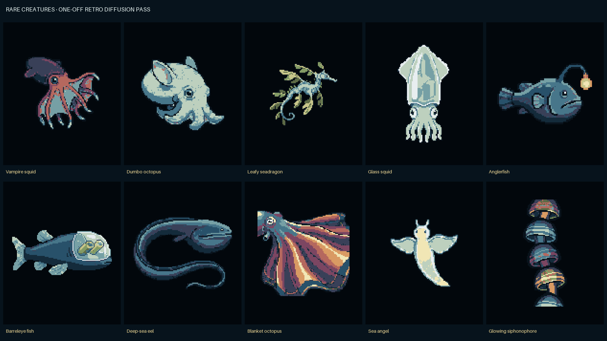
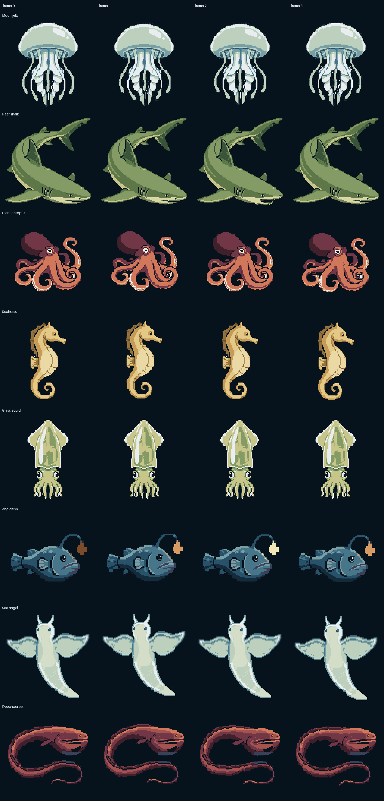

# Selected rare-creature concepts

## Decision

The four selected concept-pass additions are:

1. Glass squid
2. Deep-sea gulper eel
3. Anglerfish
4. Sea angel

Here, **“squid” means the glass squid**, specifically seed `4514`. An earlier
handoff draft named the vampire-squid seed `4511` candidate; that was corrected
before runtime productionization. `vampire_squid__4511.png` remains a useful
comparison artifact but is not referenced by the production variation
manifest or generated header.

The `rare_concepts` directory records the historical concept pass, not the
final gameplay rarity of every selected animal. The production tier assignment
is glass squid **basic**, sea angel **medium**, and anglerfish plus deep-sea eel
**rare**. Together with moon jelly, reef shark, giant octopus, and seahorse,
the runtime roster is now eight creatures.

## Historical concept-pass boundary

At the time this handoff was first written, each selection existed as exactly
one Retro Diffusion review candidate. Those images were preview-only, were not
referenced by the production variation manifest, generated runtime header,
Phonics Picker, or Ocean demo, and had not been flashed. They were correctly
described as neither production-ready nor device-verified.

That history remains important: the raw PNGs and adjacent metadata are
immutable audit sources, not outputs to regenerate during a normal firmware
build. The original four accepted creature sources and their historical device
evidence also remain intact.

The complete one-pass comparison is here:

## Current productionization state

The four selected sources are now integrated into
`creatures/variation/variation_manifest.json`, the deterministic generated
header, the Ocean demo, and the Phonics Picker's bounded correct-answer reward.
Each of the eight species has four complete frames, for 32 generated frames in
total.

The current variation report passes its host-side source, packing, mask,
overlay, palette, anatomy, and animation gates, and the repository's firmware
compile gate passes with the generated assets. The exact generated build was
also installed through the canonical five-region path on the confirmed V2
board. The production verifier exercised all eight normal and all eight
authored-rare renderer paths. A later deterministic capture also records all
180 finite allowed palette/texture/rare combinations on the unmirrored V2
display, with one representative seed for each categorical combination. A
separate microphone recording covers a real replay, wrong answer, unchanged
round, correct choice, glass-squid reward transition, and next round. Exact
hashes and the limits of that physical evidence are recorded in
`DEVICE_REPORT.md`. The separate Ocean demo's full Stage-3/Stage-4 diagnostic
flash gate and unrelated hands-on touch/power gates remain pending.

The complete generated motion comparison is here:

## Exact selected sources

| Species | Seed | Concept logical frame | Production logical frame | Raw candidate | Metadata | SHA-256 |
|---|---:|---:|---:|---|---|---|
| Glass squid | `4514` | `80 x 112` | `80 x 112` at `3x` | [`glass_squid__4514.png`](generated/raw/glass_squid__4514.png) | [`glass_squid__4514.json`](generated/raw/glass_squid__4514.json) | `7a9df7e4d5473baa3993855b8a4aa86bf1caa69208429d36fd9d24028e667765` |
| Deep-sea gulper eel | `4521` | `112 x 88` | `112 x 88` at `3x` | [`gulper_eel__4521.png`](generated/raw/gulper_eel__4521.png) | [`gulper_eel__4521.json`](generated/raw/gulper_eel__4521.json) | `e526613ca563bcbd39f0d1bfb133bad453bd7d8cad877972f2a947e0a7988f73` |
| Anglerfish | `4515` | `112 x 72` | `112 x 72` at `3x` | [`anglerfish__4515.png`](generated/raw/anglerfish__4515.png) | [`anglerfish__4515.json`](generated/raw/anglerfish__4515.json) | `ea6d9d7a67f31c4c5f38e66e297b4a195e1bc500bf0b1b04e3eb45d611fe05f2` |
| Sea angel | `4519` | `80 x 112` | `88 x 96` at `4x` | [`sea_angel__4519.png`](generated/raw/sea_angel__4519.png) | [`sea_angel__4519.json`](generated/raw/sea_angel__4519.json) | `2554b1c81a344bf29b484237f893d09eb21642cfddaceb4e2b93bae4b6f3bdac` |

All four raw files are `128 x 128` RGBA images with real transparency. The
manifest performs the reviewed crop and fit into the production logical frame;
the sea angel deliberately uses a wider, shorter logical layout and `4x`
display scale to fill the portrait screen.

## Authoring workflow and retained cost record

The concepts used the same approved visual route as the original creatures:

- Vendor/model response: Retro Diffusion `rd_pro`
- Request style: `rd_pro__simple`
- Fixed source size: `128 x 128`
- Background removal: enabled
- Style: `02_evolutionary_16bit`
- Generator: [`scripts/generate_rare_creature_concepts.py`](../../scripts/generate_rare_creature_concepts.py)
- Preview manifest: [`concept_manifest.json`](concept_manifest.json)
- Production pipeline contract:
  [`docs/CREATURE_SPRITE_PIPELINE.md`](../../docs/CREATURE_SPRITE_PIPELINE.md)

The exact shared palette, complete prompts, fixed seeds, concept logical sizes,
and avoid constraints are recorded in `concept_manifest.json`. The JSON beside
each PNG records the exact submitted prompt and service response. Do not place
an authoring credential in this repository or in generated metadata.

Retro Diffusion reported `0.18` balance units per selected candidate, or `0.72`
balance units total. These are provider balance units, not a USD amount.

## Production animation and anatomy decisions

### Glass squid

- The broad glassy mantle, paired natural eyes, visible internal column, and
  short connected arms remain the identifying forms.
- Its `glass_squid_pulse` four-frame loop contracts only the upper mantle. The
  eyes and internal column remain fixed while connected arm tips drift
  slightly.
- Common procedural patterns cannot touch the protected internal anatomy. A
  separately authored rare-safe region permits only the reviewed Prismatic
  panes treatment to cross selected internal areas.
- Automatic rewards restrict it to `tide_slate`, `kelp_green`, and
  `moon_pale`; the warmer and deep-plum ramps are excluded to preserve the
  translucent read.

### Deep-sea gulper eel

- The long body curve, enlarged pouch-like head, calm mouth, and narrow tail
  distinguish it from the shark. It has no visible teeth.
- Its `eel_undulate` loop sends a low-amplitude traveling bend down the body
  and fades it to zero before the head, keeping the eye, mouth, and pouch
  stable.
- Its authored rare treatment is Ghost current.

### Anglerfish

- The compact heavy head, tapered body, calm eye, closed toothless mouth, and
  forehead lure remain protected anatomy. In `anglerfish_hover`, the tail
  paddles while the head hovers with restrained motion.
- The lure stays attached and uses a fixed, palette-independent glow ramp:
  dim `#7B4B2A`, medium `#D89A63`, bright `#F1E6B5`, then medium. The builder
  requires strictly increasing luminance and a glow-role pixel in every frame.
- Its authored rare treatment is Abyssal constellation.

### Sea angel

- The tapered translucent body, paired head tentacles, central internal glow,
  and two broad swimming lobes remain the identifying forms.
- Its `sea_angel_wingbeat` frames use a symmetrical wing beat and small body
  lift. The wider `88 x 96` logical frame is displayed at `4x` for a
  `352 x 384` footprint.
- `celebration_sparkles` is false. Common variants and the rare Halo wings
  treatment add no detached generic sparkles.
- Automatic rewards restrict it to `tide_slate`, `kelp_green`, and
  `moon_pale` to preserve the pale translucent read.

The existing reef shark's `shark_swim` was updated in the same production pass.
Its tail swim now includes a lower-snout chomp with jaw offsets `0, 1, 3, 1`,
reading as closed, half, open, half. The gate requires one connected
silhouette, keeps the eye and gills fixed apart from whole-body bob, and
rejects bright mouth-edge roles that could read as teeth. The Picker supplies
a separate synchronized small forward lunge.

## Variation and safety result

The current system keeps high-risk art decisions baked while allowing bounded
runtime variety:

1. Each production source is hash-pinned, semantically mapped, and rechecked
   during generation. Unmapped source colors fail the build.
2. Silhouette, contour, anatomy, shading bands, four-frame geometry, and rare
   motif placement are pre-baked and reviewed.
3. Every frame carries a conservative one-bit **common-pattern-safe** mask for
   solid, spots, stripes, and mottle. Eyes, mouths, lures, fins, arm tips,
   tentacles, contours, and identifying internal anatomy remain protected.
4. Authored rare treatments use a separate **rare-safe** definition. This may
   deliberately differ from the common map, as it does for glass squid. The
   final two-bit overlay contains the runtime authorization, and host gates
   reject clipping or changes outside that authored region.
5. Canonical logical coordinates are packed with animated pixels, keeping
   common patterns and rare motifs attached instead of crawling across motion.
6. Automatic palette selection excludes `plum_deep` for all species. Glass
   squid and sea angel allow only palette indices `0`, `1`, and `5`
   (`tide_slate`, `kelp_green`, `moon_pale`); the other six allow indices `0`,
   `1`, `2`, `4`, and `5`.
7. The eight species own distinct rare treatments: Celestial bell, Ancestral
   bands, Mantle rings, Royal diamonds, Prismatic panes, Abyssal constellation,
   Halo wings, and Ghost current.

Across all 32 frames, the passing report records `145,536` bytes of four-bit
semantics, `36,384` bytes of one-bit common-pattern masks, `72,768` bytes of
two-bit rare overlays, and `582,144` bytes of 16-bit canonical anchors, for a
total packed payload of **836,832 bytes**.

Host generation, report audits, repository checks, firmware compilation, the
guarded production flash, serial renderer coverage, and camera review are
complete for this productionized set on the exact Waveshare
ESP32-S3-Touch-AMOLED-1.8 V2 hardware. `DEVICE_REPORT.md` is the authoritative
record of what was physically observed. Do not infer from that production
consumer evidence that the separate Ocean demo's complete Stage-3/Stage-4
diagnostic gate or the remaining person-at-device interaction gates have also
been closed.
