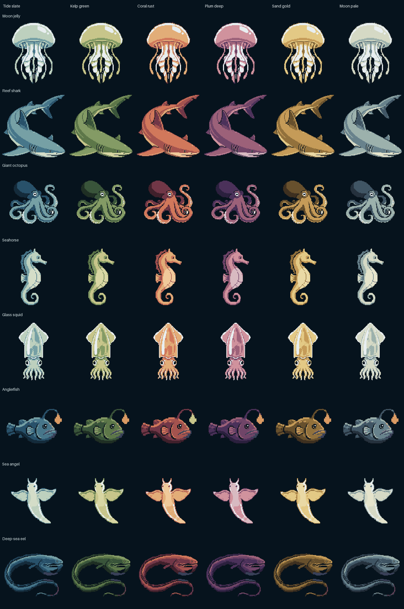
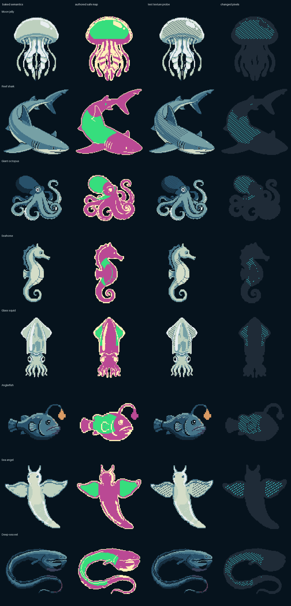
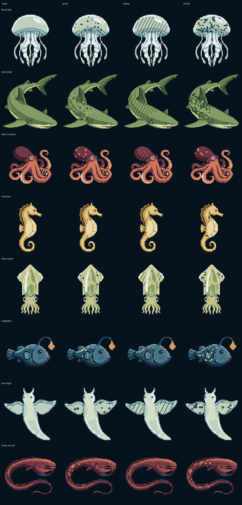
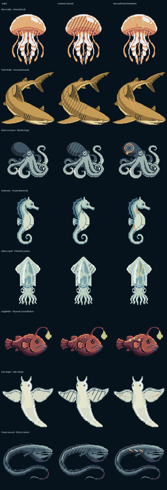

# Water-creature sprite pipeline

This is the creature authoring pipeline and its separate visual-audit demo for
the Waveshare ESP32-S3 V2 board. The demo never replaces the canonical Phonics
Picker firmware; its reviewed generated header is also consumed by the
Picker's bounded correct-answer reward. The pipeline turns reviewed source art
into small, deterministic, offline firmware assets.










## Product decision

One creature owns the screen at a time. The 368 x 448 panel is used as a
display surface for deliberately low-resolution logical art, not as permission
to add tiny detail:

| Creature | Base tier | Logical frame | Integer scale | Display footprint | Four-frame motion |
|---|---|---:|---:|---:|---|
| Moon jelly | Basic | 88 x 120 | 3x | 264 x 360 | `jelly_pulse`: bell pulse and attached tentacle sway |
| Reef shark | Rare | 120 x 124 | 3x | 360 x 372 | `reviewed_chomp`: registered closed/half/open/half sheet plus runtime lunge |
| Giant octopus | Medium | 96 x 112 | 3x | 288 x 336 | `octopus_sway`: mantle bob and attached-arm sway |
| Seahorse | Basic | 80 x 112 | 3x | 240 x 336 | `seahorse_bob`: gentle body bob and lower-body sway |
| Glass squid | Basic | 80 x 112 | 3x | 240 x 336 | `glass_squid_pulse`: upper-mantle contraction and arm drift |
| Anglerfish | Rare | 112 x 72 | 3x | 336 x 216 | `anglerfish_hover`: heavy-head hover, tail paddle, and lure pulse |
| Sea angel | Medium | 88 x 96 | 4x | 352 x 384 | `sea_angel_wingbeat`: symmetrical wing beat and body lift |
| Deep-sea eel | Rare | 112 x 88 | 3x | 336 x 264 | `eel_undulate`: traveling bend that fades before the head |

Nearest-neighbor expansion keeps the pixel grid visible and predictable. The
jelly and sea angel fill most of the panel vertically; the horizontal species
fill nearly its complete width. The demo may cycle all six ramps for visual
audit. Automatic Picker rewards exclude `plum_deep`; glass squid and sea angel
are further restricted to `tide_slate`, `kelp_green`, and `moon_pale` so their
pale translucent read survives. The other six species automatically use
`tide_slate`, `kelp_green`, `coral_rust`, `sand_gold`, or `moon_pale`.

## Pipeline

The repository uses a staged, auditable sprite workflow:

1. `creatures/ART_BIBLE.md` fixes shape language, palette, screen scale, and
   rejection criteria.
2. `creatures/creature_manifest.json` owns the original authoring prompts,
   fixed seeds, logical frame sizes, facing, animation type, and runtime scale.
   Each generated candidate retains the exact prompt actually used, so an
   older approved source remains auditable after the art brief evolves.
3. `scripts/generate_creature_candidates.py` calls PixelLab Pixflux and Retro
   Diffusion directly. It stores PNGs plus prompt, seed, response usage/cost,
   alpha bounds, and a four-way contact sheet. API keys are authoring-only.
4. `scripts/generate_creature_style_bakeoff.py` produced the historical four
   style choices. The first approved sources remain the Retro Diffusion seed
   `4501` through `4504` files under
   `raw/02_evolutionary_16bit/`; generated alternatives do not become runtime
   art merely by existing on disk.
5. `scripts/generate_rare_creature_concepts.py` later produced a separate
   comparison pass. The production additions are the exact glass squid `4514`,
   anglerfish `4515`, sea angel `4519`, and gulper eel `4521` PNGs recorded in
   `creatures/rare_concepts/SELECTED_RARE_CREATURES_HANDOFF.md`.
6. The reef shark is the reviewed production Retro Diffusion seed `82412`
   banking pose. `scripts/generate_creature_animation.py` submits that source
   to `rd_advanced_animation__custom_action`; the checked-in provider output is
   review material, never direct firmware input. The offline
   `scripts/review_creature_animation.py` restores the selected source outside
   a locked mouth polygon, quantizes only to its nine source colors, enforces
   closed/half/open/half ordering, and pins the approved contact-sheet hash.
7. `creatures/variation/variation_manifest.json` maps approved source colors
   into 16 semantic roles, defines six curated body ramps, records base rarity
   and automatic palette policy, and authors conservative common-pattern and
   rare-treatment regions.
8. `scripts/build_creature_variations.py` performs deterministic crop/fit,
   four-frame motion, four-bit semantic packing, one-bit pattern-safe packing,
   two-bit rare-overlay packing, canonical texture-anchor packing, RGB565 ramp
   validation, preview generation, and fail-closed anatomy/animation audits.
9. `firmware/OceanCreatureDemo/` renders the generated bytes directly into the
   existing off-screen RGB565 framebuffer at each species' 3x or 4x integer
   scale, then flushes only a complete frame to the AMOLED.

## Implemented variation boundary

The checked-in system implements all four bounded stages:

- Stage 1: the baked sprite stores semantic roles rather than final RGB
  values. `tide_slate`, `kelp_green`, `coral_rust`, `plum_deep`, `sand_gold`,
  and `moon_pale` supply RGB565 colors. Silhouette, contour, shading bands, and
  animation remain baked.
- Stage 2: each creature carries a frame-aligned one-bit common-pattern-safe
  map. Everything outside that map is protected from procedural texture. The
  diagnostic texture is intentionally ugly and high-contrast because its
  purpose is to expose a mask leak, not to serve as a shipping pattern.
- Stage 3: solid, clustered spots, broad diagonal stripes, and coarse mottling
  are selected at runtime from a latched 32-bit reward seed. They modify only
  the common-pattern-safe region. Every animated pixel carries its original
  logical coordinate, so a pattern remains attached instead of crawling as
  the baked frames deform.
- Stage 4: every species owns one curated two-bit treatment: Celestial bell,
  Ancestral bands, Mantle rings, Royal diamonds, Prismatic panes, Abyssal
  constellation, Halo wings, or Ghost current. A rare uses a solid body beneath
  the overlay so its authored mark remains legible.

Common pattern safety and authored rare safety are separate concepts. A
manifest-only `rare_safe` definition may authorize an intentional rare mark in
an area that remains protected from spots, stripes, and mottling. Glass squid
uses this split so its internal panes stay clean in common variants while the
reviewed Prismatic panes treatment may cross them. Other species default their
rare-safe authoring region to the common map. The two-bit overlay's nonzero
codes carry the final runtime authorization, so the split requires no second
packed one-bit mask.

The build rejects a rare overlay unless at least 90% of the complete motif and
90% of every authored primitive survive clipping. Each primitive must retain
at least eight logical pixels, the animated treatment must change at least 24
logical pixels in every frame, and no changed rare pixel may escape its
authored rare-safe region.

This is intentionally hybrid. Silhouette, anatomy, shading, animation, masks,
and rare motifs are pre-baked and reviewed. Palette choice, common texture,
texture seed, species selection, and treatment rarity are programmatic. The
result provides broad variation without asking the ESP32 to invent anatomy or
store a full sprite for every combination.

Across 32 frames and eight species, the current passing report records:

| Packed data | Bytes |
|---|---:|
| Four-bit semantics | 160,960 |
| One-bit common-pattern masks | 40,240 |
| Two-bit rare overlays | 80,480 |
| Canonical 16-bit anchors | 643,840 |
| **Total** | **925,520** |

## Animation and species-specific gates

The generated anchor remains authoritative, and every common and rare
treatment is rebuilt through the same geometry as its base frame. Motion is
bounded and deterministic:

- Moon jelly pulses its bell while tentacles stay attached.
- Reef shark uses four pre-registered reviewed frames from the selected `82412`
  banking source. Frame zero is the exact selected source; frames one and three
  are byte-identical half-open recovery frames; frame two has the clearly open,
  thick attached toothless jaw. The provider's body drift and altered facial
  pixels are discarded outside the bounded mouth patch. Host gates pin the
  provider/review hashes, fixed seven-pixel eye and gills, one connected
  silhouette, dark-cavity schedule, treatment-mask exclusion, and lack of new
  glint pixels. The Picker adds a small synchronized forward lunge.
- Giant octopus sways its lower arms while the mantle gently bobs.
- Seahorse bobs and gives the lower body a one-pixel sway.
- Glass squid contracts only the upper mantle; paired eyes and the internal
  column remain fixed while connected arm tips drift separately.
- Anglerfish holds its heavy head calm while the tail paddles. Its attached
  lure uses a palette-independent fixed ramp—dim `#7B4B2A`, medium `#D89A63`,
  bright `#F1E6B5`—on a dim/medium/bright/medium schedule. The builder requires
  strictly increasing luminance and verifies that the glow role exists in
  every frame.
- Sea angel beats both wings symmetrically and bobs its center body. Its
  `celebration_sparkles` flag is false, so even a rare Halo wings reward adds
  no detached generic sparkles.
- Deep-sea eel receives a low-amplitude traveling bend whose displacement
  fades to zero before the enlarged head, preserving its eye, mouth, and pouch.

The generated
[`animation_comparison.png`](../creatures/variation/generated/animation_comparison.png)
shows all 32 complete frames in 380-pixel-wide cells, wide enough to preserve
the full horizontal silhouettes. Its hash is part of the stored variation
report and repository verifier.

## Generate candidates

Install authoring dependencies separately from normal deployment:

```sh
python3 -m pip install -r requirements-authoring.txt
```

Provide `PIXELLAB_API_KEY` and `RETRODIFFUSION_API_KEY` (the existing lowercase
`retrodiffusion_api_key` name also works), then run:

```sh
python3 scripts/generate_creature_candidates.py --vendor both
```

Keys can instead live in an ignored env file selected with `--env-file PATH`.
The command never copies or writes key values into metadata. Existing
candidates are retained unless `--force` is explicit.

Review `creatures/generated/candidates/contact_sheet.png` at both native and
thumbnail size. Update only `creatures/selection.json` when the approved source
changes. The four production additions are preserved audit inputs and must not
be regenerated merely to rebuild firmware.

## Author an externally animated creature

The shark establishes the reusable source-conditioned animation path. The
authoring command defaults to a free cost check; a paid request requires both
explicit flags:

```sh
python3 scripts/generate_creature_animation.py --check-cost
python3 scripts/generate_creature_animation.py --generate --yes
python3 scripts/review_creature_animation.py
```

The current shark request uses a 160 x 160 RGB conditioning canvas with 16
pixels of motion room around the 128 x 128 RGBA source, a contrasting flat
background removed by the provider, four frames, one fixed generation seed,
and PNG sprite-sheet output. The async task ID is written before polling, so a
lost connection can resume with `--resume TASK_ID` without submitting and
charging a second job. Raw PNG/GIF delivery, inline base64 and hosted-output
delivery, frame count, dimensions, source hash, provider cost, and output hashes
are all retained. API keys are injected only at authoring time and are never
stored in metadata.

`scripts/review_creature_animation.py` is deliberately offline. It consumes
the retained provider frames, restores the exact selected source everywhere
outside a manifest-owned anatomy patch, creates a canonical four-frame sheet,
and fails if palette, registration, connectivity, frame order, cavity growth,
or the pinned visual-review hash drifts. Normal builds consume only those
reviewed frames. Future animals can add their own reviewed frame schedule,
bounded moving-anatomy polygon, fixed registration, and per-frame semantic
gates without adding a model call to the build or to the ESP32.

## Build and audit production assets

```sh
python3 scripts/build_creature_pack.py
python3 scripts/build_creature_variations.py
./scripts/test_creature_pipeline.sh
./scripts/test_creature_pipeline.sh --firmware
```

The legacy pack build retains the earlier two-creature source audit. The
variation build additionally fails closed on an unmapped source color, invalid
semantic/mask/rare packing, misaligned canonical anchors, a non-monotonic
five-step body ramp, a safe pixel outside the creature, a disconnected new
species, a shipping treatment that does not visibly exercise every frame,
excessive clipping of an authored motif, or any common/rare change outside its
authorized region. Its report records source hashes, base tiers, palette
masks, connected components, animation-specific gates, retained rare pixels,
protected-change counts, and animation-attachment checks for all four frames
of every species.

The report re-hashes the builder, manifest, eight source PNGs, generated
header, and five preview artifacts: palette, animation, protection, Stage 3,
and Stage 4 comparisons. `scripts/verify_creature_contract.py` derives the
expected eight-creature, four-frame contract from the manifest and requires
the report to contain the same ordered 32-frame set.

The current generated report is passing, and the firmware compile gate passes
with the generated 925,520-byte creature payload inside the pinned ESP32-S3
toolchain's 3 MB application partition. Compilation alone proves only header
and board integration. Separately, this exact generated payload was installed
in the production PhonicsGame consumer on the confirmed V2 board. The live
verifier exercised all 16 normal/rare species paths. A fresh, unmirrored
Insta360 recording then drove the complete 50-combination matrix for the two
changed species: every allowed reef-shark and giant-octopus palette crossed
with solid, spots, stripes, mottle, and the species-specific rare motif. Its
serial timeline contains an exact acknowledgement and deterministic seed for
every entry, and the recording covers more than three complete animation loops
per combination. This focused evidence supersedes only the shark and octopus
rows of the earlier 180-combination catalog; the previous footage remains
historical evidence for the six unchanged species. A separate earlier recording
covers replay, wrong-answer retention, correct choice, reward transition, and
the next round with microphone audio. Exact installation records, retained
artifact hashes, and published review-copy links are in
[`DEVICE_REPORT.md`](../DEVICE_REPORT.md).

The completed historical Stage-1/Stage-2 V2 evidence for the original roster
is recorded separately in
[`OCEAN_DEVICE_REPORT.md`](OCEAN_DEVICE_REPORT.md). It remains valid historical
evidence for the Ocean demo that was flashed at that time. The later
production-consumer evidence physically covers the four newly productionized
species, updated angler/sea-angel behavior, and the final selected `82412`
shark plus corrected octopus eye-area shading. It does not close the separate
Ocean demo's complete Stage-3/Stage-4 diagnostic flash gate or unrelated
touch/power interaction gates.

## Current review decision

The selected visual language remains `02_evolutionary_16bit`: chunky
early-1990s contours, broad cel-shaded bands, and readable anatomy inspired by
the era of E.V.O. without copying a character from it.

The baked source authority is:

- moon jelly `4501`, giant octopus `4503`, and seahorse `4504` under
  `creatures/style_bakeoff/generated/raw/02_evolutionary_16bit/`;
- reef shark `82412` under `creatures/animation/source/`, with its paid
  source-conditioned provider output and reviewed four-frame sheet under
  `creatures/animation/generated/` and `creatures/animation/reviewed/`;
- glass squid `4514`, anglerfish `4515`, sea angel `4519`, and gulper eel
  `4521` under `creatures/rare_concepts/generated/raw/`.

The exact new filenames, metadata, hashes, and historical concept-pass costs
are retained in
[`SELECTED_RARE_CREATURES_HANDOFF.md`](../creatures/rare_concepts/SELECTED_RARE_CREATURES_HANDOFF.md).

## Demo controls

The USB serial demo accepts single-character controls at 115200 baud:

- `c`: next creature and stop automatic cycling.
- `p`: next palette and stop automatic cycling.
- `t`: exit rare mode, then cycle solid, spots, stripes, and mottle; stop
  automatic cycling.
- `r`: toggle the species-specific rare treatment; enabling it forces the
  required solid base.
- `s`: advance the deterministic texture seed.
- `d`: cycle `COLOR`, `SAFE MASK`, and `TEST PROBE` modes.
- `h`: freeze or resume the current animation frame and screen drift.
- `a`: toggle automatic palette/species cycling.
- `?`: print controls and current state.
- `v`: recompute semantic, mask, all-pattern, and rare-treatment audits from
  the bytes in flash.

In `SAFE MASK`, green is texture-safe, magenta is protected anatomy, and pale
pixels identify protected contour/feature roles. `TEST PROBE` uses the same
one-bit mask read path as shipping common textures. The two-bit rare overlay is
already clipped against its separately authored rare-safe region during the
deterministic build.

## Hardware gate still required

Do not use compilation as deployment proof. First identify the intended serial
port and confirm the rear label says V2. Then review and use the dedicated demo
procedure, never the canonical phonics flash command:

```sh
./scripts/list_ports.sh
./scripts/flash_ocean_demo.sh --port PORT
python3 scripts/verify_ocean_demo.py --port PORT
```

The flash script checks for an ESP32-S3 with 16 MB flash and requires the exact
`OCEAN-V2` confirmation before writing the four ocean-demo boot regions. It
does not rewrite the canonical phonics audio-pack region at `0x610000`. The
verifier requires an explicit port and derives its expected contract from the
generated manifest/report: eight creatures, 32 frames, nonempty exercised
regions for every common pattern and rare treatment, zero missing treatment
frames, zero invalid safe pixels, and zero protected changes.

Manually verify:

- all eight creatures have the display footprints listed above;
- logical pixels are clean 3 x 3 blocks, except the intentional 4 x 4 sea
  angel, with no smoothing;
- transparent edges have no white/green halo;
- every four-frame loop reads naturally, stays attached, and exposes no
  intermediate clear;
- the shark chomp remains toothless, with a stable eye/gill; the production
  Picker's synchronized lunge is already evidenced in `DEVICE_REPORT.md`;
- the angler lure remains warm and visibly cycles dim/medium/bright/medium;
- the sea angel stays sparkle-free in both common and rare variants;
- all silhouettes remain readable at arm's length;
- the allowed ramps retain contour/shading separation in actual AMOLED
  RGB565, especially the restricted pale species;
- while frozen with `h`, toggling between `COLOR` and `TEST PROBE` changes only
  the green region shown by `SAFE MASK`; eyes, mouth/gills, contour, fins,
  tentacles/arms, internal organs, and tail remain protected as authored;
- while frozen, cycle `t`, advance `s`, and toggle `r`; each treatment stays
  attached to the moving body, remains visibly distinct, and changes only its
  separately authorized common or rare region;
- animation holds the intended frame rate without watchdog resets.
